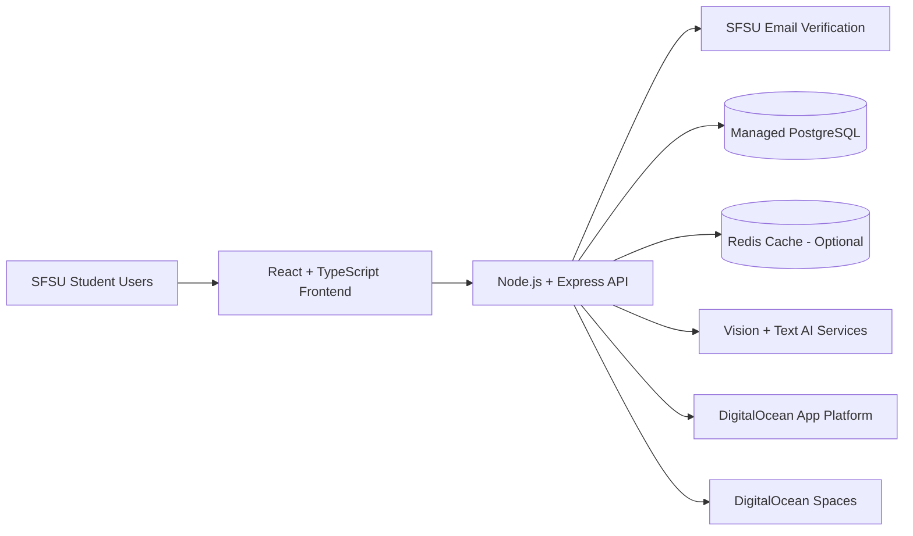

# E-Broke — Project Proposal

## Description
E-Broke is a student-only, free-item exchange platform for San Francisco State University (SFSU). The app helps students give away useful items they no longer need and helps other students find those items at no cost. Users sign in with SFSU email verification to keep the community local and trusted.

## Pain Points Solved
1. **Campus waste from usable items being discarded**
   - Students frequently throw away furniture, supplies, electronics, and dorm essentials that still work.
2. **Students need essentials but face budget constraints**
   - Many students need basic items but cannot afford them, especially during move-in/move-out periods.
3. **Friction in posting and finding free items**
   - Writing good listings and searching across scattered channels is slow and inconsistent.
4. **Trust and relevance issues in open marketplaces**
   - Existing platforms are broad and often include paid listings, spam, or non-local results.

## Why This Is Social Good
E-Broke directly supports the “AI for Social Good” goal by:
- Reducing landfill waste through reuse and local recirculation of goods.
- Increasing equitable access to essential items for students with limited budgets.
- Strengthening community connection through peer-to-peer support.
- Using AI to lower participation barriers so more students can contribute and benefit.

## Core Product Scope (Proposal MVP)
- **SFSU verification and account checks** (SFSU email required).
- **Free-only listings** (no selling allowed).
- **AI-assisted listing creation** from a quick item photo.
- **Relevant search and ranking** so students find the best matches quickly.

## AI Implementation
### 1) AI-Generated Listing Drafts
- User uploads a photo.
- Vision-capable AI suggests:
  - title
  - short description
  - category
  - condition tags (e.g., new/good/fair)
  - relevant keywords
- User reviews/edits before publishing.

### 2) Relevance Search Support
- AI-enriched metadata and keywords improve query-to-item matching.
- Ranking prioritizes relevance, recency, and local usefulness.

### 3) Free-Only and Safety Support (Assisted)
- Rule checks flag price-like text and prompt users to keep listings free-only.
- Optional moderation signals for spam/low-quality listings.

## Technology Stack (Proposed)
### Frontend
- **React + TypeScript** for responsive web UI.
- **Tailwind CSS** for fast, consistent styling.

### Backend
- **Node.js + Express** REST API.
- **PostgreSQL** for users, listings, and search metadata.
- **Redis** (optional) for caching hot searches.

### AI/ML Services
- Vision + text generation API for listing draft generation.
- Embedding/vector-based relevance support for better search ranking.

### Auth & Security
- SFSU email-based authentication/verification flow.
- Server-side validation for free-only rule enforcement.

### Deployment (DigitalOcean)
- **DigitalOcean App Platform** for web/API deployment.
- **DigitalOcean Managed PostgreSQL** for persistent data.
- **DigitalOcean Spaces** for listing image storage.
- Environment-variable based secrets management.

### Visual Diagram

## Non-MVP / Future Opportunities
- 3D model generation for listings.
- Broader social-good expansions (event buddy matching, nonprofit volunteer matching).

## Proposed Equity Feature: Prioritized Wishlist Alerts
Students can opt into a **wishlist category** (for example: textbooks, dorm essentials, electronics, winter clothing). When a matching free listing is posted, alerts are prioritized to students with the highest need signal first.

### How It Works
1. Students select one or more wishlist categories and mark urgency level.
2. Matching logic checks category fit and listing relevance.
3. Priority score ranks notifications using:
   - urgency level
   - time waiting for a match
   - recent successful claims (to reduce repeat advantage)
4. Top-ranked students receive early alerts first, then the broader category audience.

### Social Good Impact
- Improves fairness so students with greater need are seen first for critical items.
- Reduces first-click advantage and improves equitable access to free resources.
- Encourages more students to donate by improving distribution confidence and impact.
